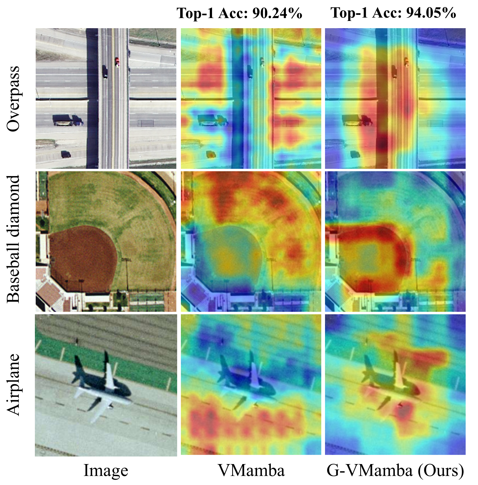

# Contour-enhanced-Visual-State-Space-Model
G-VMamba: Contour-enhanced Visual State-Space Model for Remote Sensing Image Classification

## Introduction
The current branch has been tested on Linux system, PyTorch 1.13.X and CUDA 11.6, supports Python 3.8+.

## Overview

* **Class activation map (CAM) visualization of the final normalization layer for [VMamba](https://github.com/MzeroMiko/VMamba) and G-VMamba Models’ classification of UC-Merced dataset images.**

When the model classifies the scenes in the image, the G-VMamba model focuses on areas where the color (or brightness) of the image changes more significantly (red areas), such as the lane intersection position of the Overpass scene, the edge of the court in the Baseball diamond scene, and the airplane shadow and lawn border of the Airplane scene. (The model size is ‘Small’.)
<p align="center">
  
</p>


* **The overall architecture: (a) Overview of G-VMamba model; (b) Feature grouping in the G-VSS block.**

<p align="center">
  
</p>


## Preparing the dataset

<details open>

### Remote Sensing Image Classification Dataset

We provide the method of preparing the remote sensing image classification dataset used in the paper.

#### UC Merced Dataset

- Image and annotation download link: [UC Merced Dataset](http://weegee.vision.ucmerced.edu/datasets/landuse.html).

#### AID Dataset

- Image and annotation download link: [AID Dataset](https://www.kaggle.com/datasets/jiayuanchengala/aid-scene-classification-datasets)。

#### NWPU RESISC45 Dataset

- Image and annotation download link: [NWPU RESISC45 Dataset](https://aistudio.baidu.com/datasetdetail/220767)。

## Installation
**Step 1.** Create a conda environment and activate it.

```shell
conda create -n Gvmamba python=3.9
conda activate Gvmamba
```

**Step 2.** Install the requirements.

- Torch1.13.1 + cu116
```shell
pip install -i https://pypi.tuna.tsinghua.edu.cn/simple torch==1.13.1 --extra-index-url https://download.pytorch.org/whl/cu116
pip install -i https://pypi.tuna.tsinghua.edu.cn/simple torchvision==0.14.1 --extra-index-url https://download.pytorch.org/whl/cu116
pip install torchaudio==0.13.1 --extra-index-url https://download.pytorch.org/whl/cu116
```

**Step 3.** Install the VMamba.

Please refer to the [code support](https://github.com/MzeroMiko/VMamba).

**Step 4.** Configuring G-VMamba core components.

Replace the contents of the <u>*models*</u> folder under the <u>*classification*</u> folder.

### Model Training and Inference

If you only want to test the performance:

```bash
python -m torch.distributed.launch --nnodes=1 --node_rank=0 --nproc_per_node=1 --master_port=29500 main.py --cfg </path/to/config> --batch-size 128 --data-path </path/of/dataset> --output /tmp --pretrained </path/of/checkpoint>
```

**Train:**

Training with a single GPU:

```bash
torchrun --nnodes=1 --node_rank=0 --nproc_per_node=1 main.py --cfg </path/to/config> --batch-size 16 --data-path </path/of/dataset> --output </path/of/output>
```

Training with multiple GPUs:

```bash
export CUDA_VISIBLE_DEVICES=0,1,2,3,4

torchrun --nnodes=1 --node_rank=0 --nproc_per_node=5 --master_port=29500 --rdzv_id=12345 --rdzv_backend=c10d --rdzv_endpoint=localhost:29500 main.py --cfg </path/to/config> --batch-size 8 --data-path </path/of/dataset> --output </path/of/output>
```

## Citation

```
@ARTICLE{10810482,
  author={Yan, Liyue and Zhang, Xing and Wang, Kafeng and Zhang, Dejin},
  journal={IEEE Transactions on Geoscience and Remote Sensing}, 
  title={Contour-enhanced Visual State-Space Model for Remote Sensing Image Classification}, 
  year={2024}
  }
```

## Acknowledgment

This project is mainly based on VMamba ([paper](https://arxiv.org/abs/2401.10166), [code](https://github.com/MzeroMiko/VMamba)), Swin-Transformer ([paper](https://arxiv.org/pdf/2103.14030.pdf), [code](https://github.com/microsoft/Swin-Transformer)), pytorch-grad-cam ([code](https://github.com/jacobgil/pytorch-grad-cam)), etc, thanks for their excellent works.


